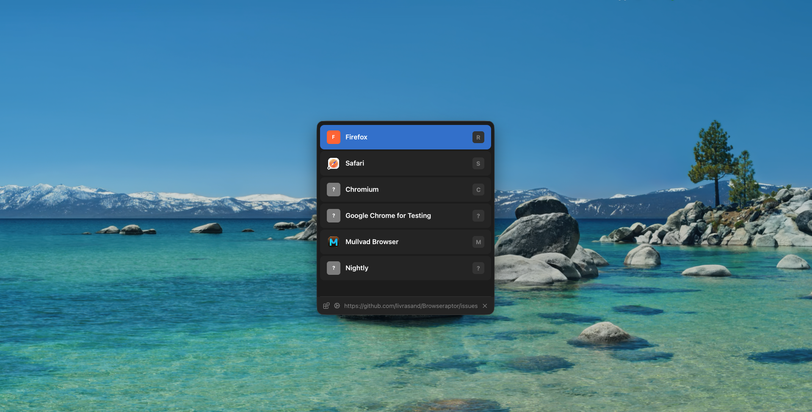

# Browseraptor

Browseraptor is a tiny, cross-platform Rust application that lets you quickly choose which browser to open a link with, and includes a plugin system — it intercepts links system-wide and routes them to the right browser based on your own rules. Written in Rust for speed and safety.



Inspired by the incredible [Browserino](https://github.com/AlexStrNik/Browserino), but faster, safer and customizable thanks to Rust. 

> **This project is in active development.** Features may change, and some things might break. If you run into a problem or have an idea, [open an issue](https://github.com/livrasand/Browseraptor/issues). Contributions are welcome!

> [!NOTE]
> This software is currently in pre-v1.0 version, which means it can frequently introduce breaking changes with new versions.

## Install

<a href="https://github.com/livrasand/Browseraptor/releases">
</a>

## Building from source

**Prerequisites:** Rust **nightly** toolchain (the project requires it via `rust-toolchain.toml`).

```sh
# Install Rust if you don't have it
curl --proto '=https' --tlsv1.2 -sSf https://sh.rustup.rs | sh

# Install the nightly toolchain
rustup toolchain install nightly
```

### macOS

```sh
git clone https://github.com/livrasand/Browseraptor.git
cd Browseraptor 
cargo build --release
# Binary will be at: target/release/browseraptor
```

To build the `.app` bundle:

```sh
chmod +x bundle_macos.sh
./bundle_macos.sh
# App will be at: dist/Browseraptor.app
```

> **Note:** Xcode Command Line Tools are required (`xcode-select --install`).

### Linux

```sh
git clone https://github.com/livrasand/Browseraptor.git
cd Browseraptor
cargo build --release
# Binary will be at: target/release/browseraptor
```

Required system packages (Debian/Ubuntu):

```sh
sudo apt install libgtk-3-dev libxdo-dev libssl-dev pkg-config
```

Fedora/RHEL:

```sh
sudo dnf install gtk3-devel libxdo-devel openssl-devel
```

### Windows

```sh
git clone https://github.com/livrasand/Browseraptor.git
cd Browseraptor
cargo build --release
# Binary will be at: target\release\browseraptor.exe
```

> **Note:** [Visual Studio Build Tools](https://visualstudio.microsoft.com/visual-cpp-build-tools/) with the **Desktop development with C++** workload is required.

## Stopping the daemon

Browseraptor runs as a background daemon. To stop it from the terminal:

### macOS / Linux

```sh
# Graceful stop
pkill -x browseraptor

# If it does not respond, force kill
pkill -9 -x browseraptor
```

Or find the PID manually and kill it:

```sh
pgrep browseraptor        # shows the PID
kill <PID>
```

### Windows (cmd)

```cmd
taskkill /IM browseraptor.exe /F
```

Or using PowerShell:

```powershell
Stop-Process -Name browseraptor -Force
```

---

# Contributors

For information on contributing to this project, please see [CONTRIBUTING.md](/CONTRIBUTING.md).

---

Star this repo if you believe developers deserve the right to contribute anonymously.

[](https://x.com/intent/tweet?text=Check%20out%20this%20project%20on%20GitHub:%20https://github.com/livrasand/Browseraptor)
[](https://www.facebook.com/sharer/sharer.php?u=https://github.com/livrasand/Browseraptor)
[](https://www.linkedin.com/sharing/share-offsite/?url=https://github.com/livrasand/Browseraptor)
[](https://www.reddit.com/submit?title=Check%20out%20this%20project%20on%20GitHub:%20https://github.com/livrasand/Browseraptor)
[](https://t.me/share/url?url=https://github.com/livrasand/Browseraptor&text=Check%20out%20this%20project%20on%20GitHub)

Be a ghost. Fix the internet.

*✨ Thanks for visiting **Browseraptor**!*


